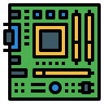
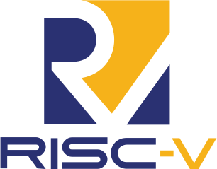
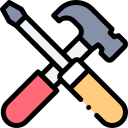

## Welcome to my Github page! 

This is Hank from  <b>Taichung, Taiwan</b>   
I'm currently a <a href="https://www.cs.nycu.edu.tw">Computer Engineering</a> major student at <a href="https://www.nycu.edu.tw">National Yang Ming Chiao Tung University</a>  
My interest of study is <b>Digital System Design</b> and <b>Machine Learning</b>

 

  
## language and Tools

  

 

     
 

      

## Where to find me

 

